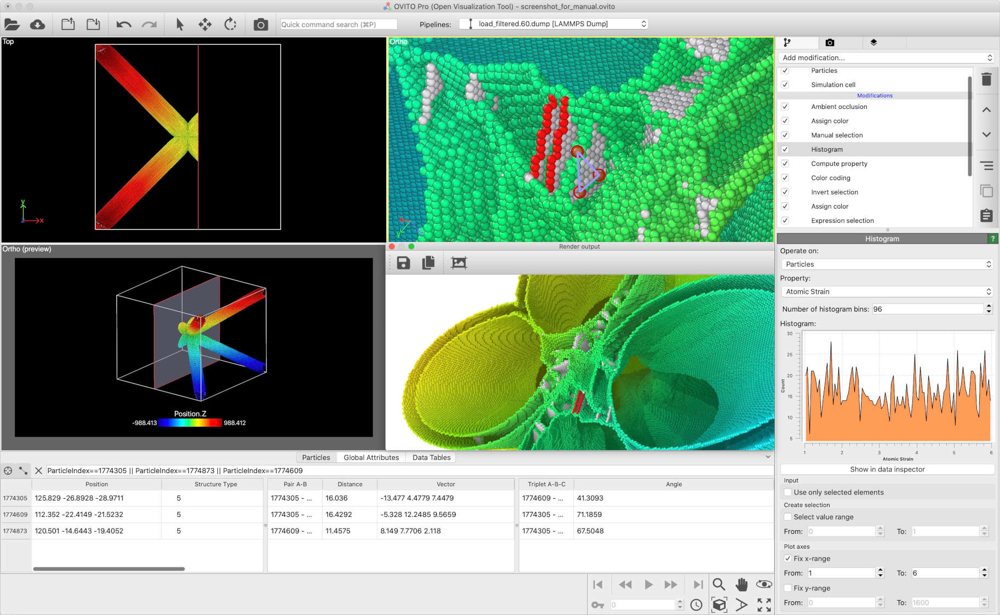

.. _about_ovito:

===========
About OVITO
===========

OVITO (Open Visualization Tool) is a *scientific data visualization and analysis software* designed for molecular and particle-based simulation models.
It is widely used in computational materials science, engineering, physics, and chemistry.
The software has been cited in over `20,000 research publications <https://scholar.google.com/citations?view_op=view_citation&hl=en&user=f8Tw3eEAAAAJ&citation_for_view=f8Tw3eEAAAAJ:u5HHmVD_uO8C>`__.

**A cross-platform 3D visualization tool**

OVITO is a 3D graphics desktop application available for Windows, Linux, and macOS.
It is developed and distributed by `OVITO GmbH <https://www.ovito.org>`__, a German independent software vendor founded by
OVITO's original author, `Dr. Alexander Stukowski <http://scholar.google.com/citations?user=f8Tw3eEAAAAJ>`__.

In addition to the main application, the OVITO ecosystem includes the
:ref:`OVITO Python module <scripting_manual>`, a standalone scripting framework that enables advanced post-processing and data analysis of simulation outputs.

**Origins and evolution**

`First released in 2009 <http://stacks.iop.org/0965-0393/18/015012>`__, OVITO originated as part of a Ph.D. project at the
`Materials Science Department` of `Technische Universität Darmstadt`. For years, it remained an academic open-source project, developed voluntarily by a single researcher.
Despite its increasing adoption in the scientific community, sustaining long-term development without sufficient funding was a challenge.

A turning point came in 2020, when *OVITO GmbH* was founded. The company's mission is to ensure the continued development,
professional maintenance, and dedicated user support through license fees, securing OVITO's future as a reliable scientific tool.

For more information about OVITO, refer to this user manual or visit the official website, `www.ovito.org <https://www.ovito.org>`__.